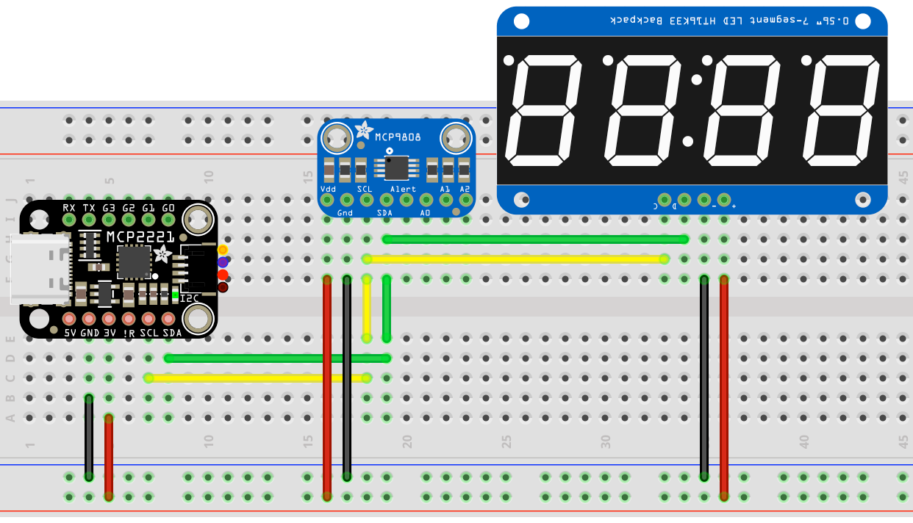
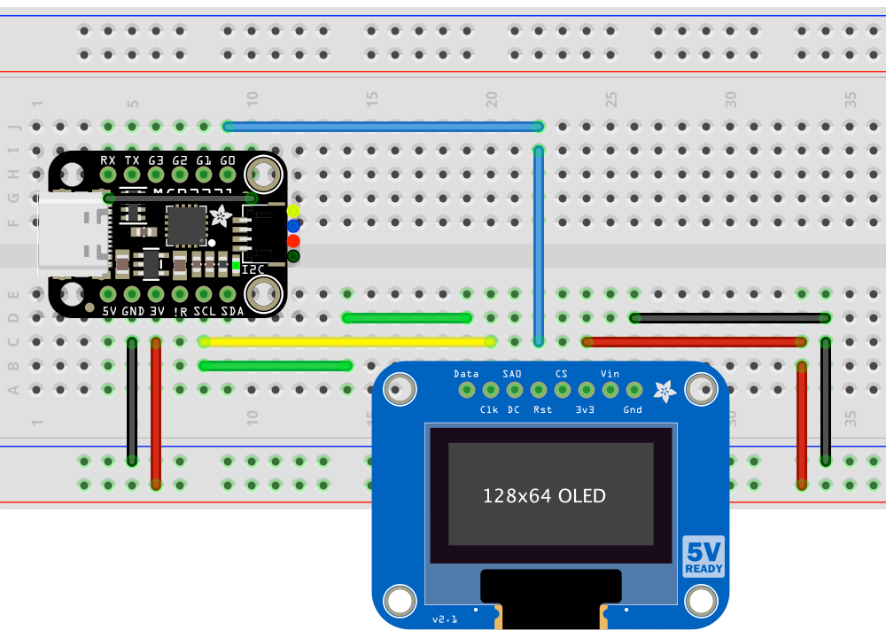

# MCP2221-Mac #

This repo is dedicated to using [Adafruit’s MCP2221 Breakout](https://www.adafruit.com/product/4471) with a Mac.

## Installation ##

Run each of the following at the command line (macOS’ *Terminal*):

1. `pip3 install hidapi adafruit-blinka`
2. `echo 'export BLINKA_MCP2221=1' >> ~/.bash_profile`

Now quit *Terminal* and the restart it to make use of the updated *bash* profile.

Connect an MCP2221 Breakout to one of your Mac’s USB ports. Depending on which Mac you have, you may need a USB-to-USB-C adaptor or cable.

## Examples ##

This repo contains a number of simple apps to try:

### I2C ###

The first set of examples make use of an [Adafruit 0.56-inch 4-digit, 7-segment LED display](http://www.adafruit.com/products/878) connected to the MCP2221 Breakout’s I&sup2;C pins, SCL and SDA. The display is driven by a separate library, `htk1633segment_circuitpython.py`, which is included here to make it easy to import. You can visit the library’s source repo [here](https://github.com/smittytone/HT16K33Segment-Python).

The last two examples, `cpu.py` and `network.py`, require *psutil*, installed using `pip3 install psutil`.

- [`countdown.py`](./i2c/countdown.py) — Count down from 9999 to 0.
- [`countup.py`](./i2c/countup.py) — Count up from 0 to 9999.
- [`cpu.py`](./i2c/cpu.py) — See your Mac’s processor utilization in real time.
- [`network.py`](./i2c/network.py) — See a count of received packets in real time (resets at 9999).

The following example uses an [Adafruit MCP9808 temperature sensor breakout](https://www.adafruit.com/product/1782) along with the seven-segment LED. To make use of the sensor, you need to install its driver library as follows: `pip3 install adafruit-circuitpython-mcp9808`. That done you can run the code to display the current ambient temperature on the LED.

- [`mcp9808.py`](./i2c/mcp9808.py) — Display atmospheric temperature readings. 

The following examples use either an [Adafruit 128x64 OLED](https://www.adafruit.com/product/326) panel connected to the MCP2221 Breakout’s I&sup2;C pins. The display is driven by a separate library, `ssd1306_circuitpython.py`, which is included here to make it easy to import. `macinfo.py` also requires *psutil*, installed using `pip3 install psutil`.

- [`macinfo_128x64.py`](./i2c/macinfo_128x64.py) — See a wider selection of Mac system info in real time on a 128x64 display.
- [`boxes_128x64.py`](./i2c/boxes_128x64.py) — As above but for the 128x64 display. 
